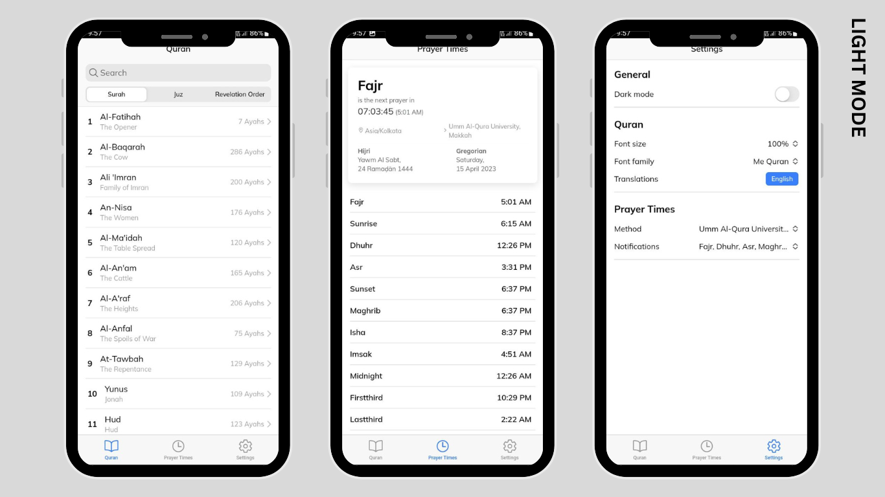

[![Contributors][contributors-shield]][contributors-url]
[![Forks][forks-shield]][forks-url]
[![Stargazers][stars-shield]][stars-url]
[![Issues][issues-shield]][issues-url]
[![MIT License][license-shield]][license-url]
[![LinkedIn][linkedin-shield]][linkedin-url]
[![Telegram][telegram-community-shield]][telegram-community-url]

<!-- PROJECT LOGO -->
 

  

  <h3 align="center">Islam</h3>

  

    Quran, Hadiths, Sunnah and Dhikrs in one place!
     
    <a href="https://github.com/Muhammed-Rahif/Islam/releases/latest"><strong>Download the latest app »</strong></a>
     
     
    <a href="#screenshots">Screenshots</a>
    ·
    <a href="https://github.com/Muhammed-Rahif/Islam/issues">Report Bug</a>
    ·
    <a href="https://github.com/Muhammed-Rahif/Islam/issues">Request Feature</a>
  

<!-- START doctoc -->
<!-- END doctoc -->

<!-- ABOUT THE PROJECT -->

## About The Project

The Islam Application is a mobile app created for Muslims, offering access to the Quran, Sunnah, and Dhikrs. The app is designed to serve as a valuable resource for Muslims who are looking to enhance their knowledge and practice of Islam.

The app has been developed with the intention of being a source of reward for its contributors. Contributors to the app can earn sadaqah jariyah, a form of ongoing charity that continues to benefit the giver even after they have passed away, by contributing to its development.

The Islam Application has been built using the Ionic iOS theme, and offers both dark and white modes for the user's convenience. We welcome contributions to the app from the community, and encourage contributors to refer to the CONTRIBUTING.md file for guidelines on how to contribute.

We hope that the Islam Application will prove to be a valuable resource for Muslims worldwide, and we welcome your feedback and suggestions on how we can improve the app further.

(<a href="#readme-top">back to top</a>)

## Features

The Islam Application includes the following features:

- Access to the Quran, Sunnah, and Dhikrs
- Dark and white mode available
- Made with Ionic iOS theme

(<a href="#readme-top">back to top</a>)

## Getting Started

To get a local copy up and running follow these steps below.

### Prerequisites

- `npm` or `yarn` (`yarn` preferred)
- `nodejs` version 18.12+

### Installation and running

1. Install ionic and capcitor globally `npm i -g @ionic/cli @capacitor/cli`.
1. Install dependencies `yarn install`
1. To start development server locally run `ionic serve`

### Testing

1. Install playwright browsers `yarn playwright install --with-deps chromium chrome`
1. Run test cases `yarn playwright test`

## Contributing

We welcome contributions to the ISLAM Application from the community. If you're interested in contributing, please see the guidelines outlined in the [CONTRIBUTING.md](CONTRIBUTING.md) file.

(<a href="#readme-top">back to top</a>)

<!-- We welcome contributions to the Islam Application! If you'd like to contribute, follow these steps:
1. Fork this repository to your GitHub account.
2. Clone the forked repository to your local machine.
3. Create a new branch for your changes using `git checkout -b <my-new-branch>`.
4. Make your changes and commit them with descriptive commit messages.
5. Push your changes to your forked repository with `git push origin <my-new-branch>`.
6. Create a pull request from your forked repository to this repository.
7. Wait for the maintainers to review your changes and merge them into the main branch. -->

## Join our Telegram community group.

Join our community on Telegram to stay up-to-date with the latest updates of the app, ask questions, and share your feedback and ideas with other members.
To join our Telegram group, follow these steps:

[![Telegram][telegram-community-shield]][telegram-community-url]

We look forward to connecting with you on Telegram and hearing your thoughts about our app!

(<a href="#readme-top">back to top</a>)

## Technologies Used

The Islam project is built using the following technologies:

- 
- [![React][react.js]][react-url]
- [![Ionic][ionic]][ionic-url]
- [![Capacitor][capacitor]][capacitor-url]
- [![Tailwind CSS][tailwind-css]][tailwind-css-url]
- [![Vite][vite]][vite-url]
- [![Playwright][playwright]][playwright-url]

(<a href="#readme-top">back to top</a>)

## Contact Author

(<a href="#readme-top">back to top</a>)

## License

The Islam Application is licensed under the [MIT License](https://opensource.org/licenses/MIT). See [`LICENSE.txt`](LICENSE.txt) for more information.

(<a href="#readme-top">back to top</a>)

[contributors-shield]: https://img.shields.io/github/contributors/Muhammed-Rahif/Islam.svg?style=for-the-badge
[contributors-url]: https://github.com/Muhammed-Rahif/Islam/graphs/contributors
[forks-shield]: https://img.shields.io/github/forks/Muhammed-Rahif/Islam.svg?style=for-the-badge
[forks-url]: https://github.com/Muhammed-Rahif/Islam/network/members
[stars-shield]: https://img.shields.io/github/stars/Muhammed-Rahif/Islam.svg?style=for-the-badge
[stars-url]: https://github.com/Muhammed-Rahif/Islam/stargazers
[issues-shield]: https://img.shields.io/github/issues/Muhammed-Rahif/Islam.svg?style=for-the-badge
[issues-url]: https://github.com/Muhammed-Rahif/Islam/issues
[license-shield]: https://img.shields.io/github/license/Muhammed-Rahif/Islam.svg?style=for-the-badge
[license-url]: https://github.com/Muhammed-Rahif/Islam/blob/master/LICENSE.txt
[linkedin-shield]: https://img.shields.io/badge/-LinkedIn-black.svg?style=for-the-badge&logo=linkedin&colorB=555
[linkedin-url]: https://www.linkedin.com/in/muhammed-rahif
[telegram-community-shield]: https://img.shields.io/badge/Join%20Us%20on-Telegram-2CA5E0?style=for-the-badge&logo=telegram&logoColor=white
[telegram-community-url]: https://t.me/islam_app_community
[react.js]: https://img.shields.io/badge/React-20232A?style=for-the-badge&logo=react&logoColor=61DAFB
[react-url]: https://reactjs.org/
[ionic]: https://img.shields.io/badge/Ionic-3880FF?style=for-the-badge&logoColor=white&logo=ionic
[ionic-url]: https://ionic.io/
[capacitor]: https://img.shields.io/badge/Capacitor-119EFF?style=for-the-badge&logoColor=white&logo=capacitor
[capacitor-url]: https://capacitorjs.com/
[daisyui]: https://img.shields.io/badge/DaisyUI-5A0EF8?style=for-the-badge&logoColor=white&logo=daisyui
[daisyui-url]: https://daisyui.com/
[tailwind-css]: https://img.shields.io/badge/Tailwind%20CSS-06B6D4?style=for-the-badge&logo=tailwind-css&logoColor=white
[tailwind-css-url]: https://tailwindcss.com/
[vite]: https://img.shields.io/badge/vite-646CFF?style=for-the-badge&logo=vite&logoColor=white
[vite-url]: https://vitejs.dev/
[playwright]: https://img.shields.io/badge/playwright-2EAD33?style=for-the-badge&logo=playwright&logoColor=white
[playwright-url]: https://playwright.dev/
