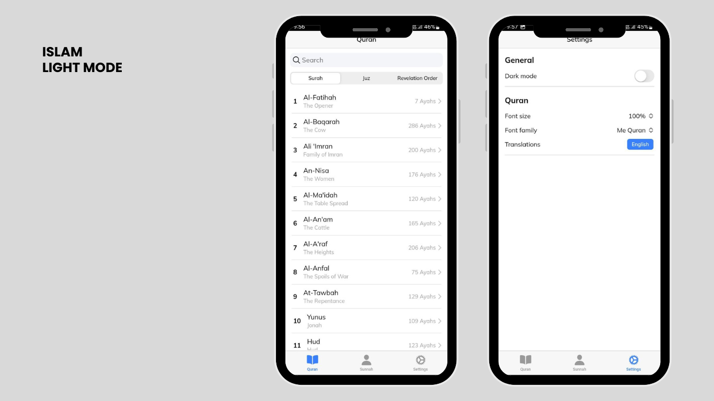
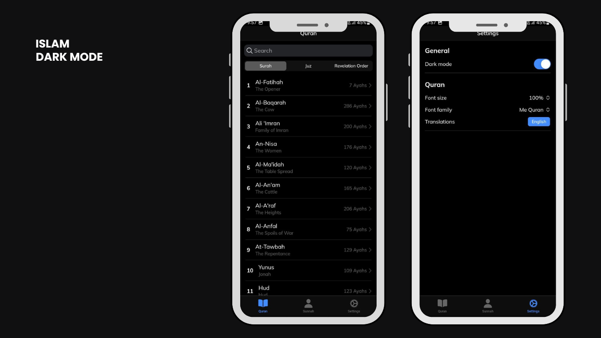

<!-- ABOUT THE PROJECT -->
# About The Project

## Features

The ISLAM Application includes the following features:

1. Feature 1
2. Feature 2
3. Feature 3
4. Feature 4
5. Feature 5

## Contributing

We welcome contributions to the ISLAM Application! If you'd like to contribute, follow these steps:

1. Fork this repository to your GitHub account.
2. Clone the forked repository to your local machine.
3. Create a new branch for your changes using `git checkout -b <my-new-branch>`.
4. Make your changes and commit them with descriptive commit messages.
5. Push your changes to your forked repository with `git push origin <my-new-branch>`.
6. Create a pull request from your forked repository to this repository.
7. Wait for the maintainers to review your changes and merge them into the main branch.

## Join our Telegram community group.

Join our community on Telegram to stay up-to-date with the latest updates, ask questions, and share your feedback and ideas with other members.
To join our Telegram group, follow these steps:

1. Download the Telegram app on your phone or computer, if you haven't already done so.
2. Click on this link to go to our Telegram group: 
3. Click on the "Join Group" button to become a member of our community.

We look forward to connecting with you on Telegram and hearing your thoughts about our app!

## Technologies Used

The ISLAM Application/Project is built using the following technologies:

- 
- 
- 
- 
- 

## Contact
- Muhammed Rahif  
  
  
  
  
  

## License

The ISLAM Application is licensed under the [MIT License](https://opensource.org/licenses/MIT). See `LICENSE.txt` for more information.
